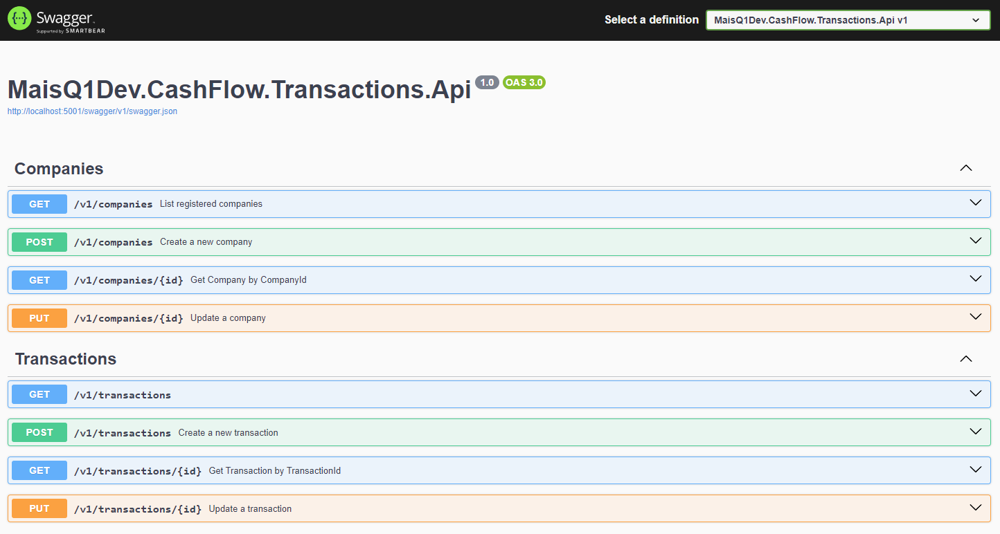
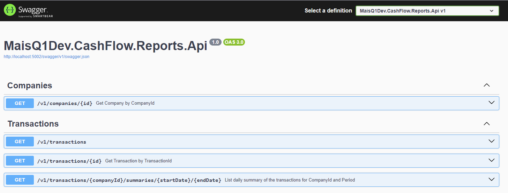

# Cashflow

## 🎖️ Desafio
Implementar um controle de fluxo de caixa, onde o usuário poderá efetuar os lançamentos das transações de crédito e débito, além de obter relatórios com o saldo do seu fluxo de caixa e um resumo diário das suas transações.

## 📱 Projeto

### Transactions Api
Desenvolvimento de uma API RESTful completa, fornecendo recursos para a criação e atualização dos lançamentos de crédito e débito. Efetuando a sincronização dos lançamentos através da integração com o serviço de relatórios utilizando mensageria, permitindo que seu funcionamento continue caso o serviço de relatório tenha sido interrompido.



### Reports Api
Desenvolvimento de uma API RESTful completa, fornecendo recursos para a leitura do saldo total, lançamentos de crédito e débito e resumo diários dos lançamentos em um deteminado período.



## ⚙️ Tecnologias
* 
* 
* 
* 
* 
* 
* 
* 

## 🧪 Como testar o projeto

### Antes de realizar os passos abaixo, é necessário instalar:
- SDK .NET 8.0.x
- Visual Studio 2022 ou VS Code
- Docker, WSL, Docker Desktop ou Rancher Desktop

[-] Faça clone do projeto:
```
git clone https://github.com/mais-q1-dev/cash-flow.git
```

[-] Configurar as variáveis de ambiente através do arquivo .env na raiz do projeto


[-] Execute o projeto utilizando o Docker Compose:

#### Na raiz do projeto executar o comando:
```powershell
docker-compose up -d --build
```

[-] Execute o projeto através da linha de comando:

#### Necessário a instalação do PostgresSQL, PgAdmin e RabbitMQ. Podendo ser executado através do Docker:
```powershell
docker run --name postgres -e POSTGRES_USER=myuser -e POSTGRES_PASSWORD=mysecretpassword -p 5432:5432 -d postgres:16.3-alpine
```
```powershell
docker run --name pgadmin -p 15432:80 -e PGADMIN_DEFAULT_EMAIL=myuseremail -e PGADMIN_DEFAULT_PASSWORD=mysecretpassword -d dpage/pgadmin4:8.10
```
```powershell
docker run --name rabbitmq -p 5672:5672 -p 15672:15672 -e RABBITMQ_DEFAULT_USER=myuser -e RABBITMQ_DEFAULT_PASS=mysecretpassword -d masstransit/rabbitmq:3.13.1
```

#### Na raiz do projeto executar os comandos:
```powershell
dotnet restore
```
```powershell
dotnet clean
```
```powershell
dotnet build --no-incremental
```
#### Na pasta Reports/src/MaisQ1Dev.CashFlow.Reports.Api, executar o comando:
```powershell
dotnet run
```
#### Na pasta Transactions/src/MaisQ1Dev.CashFlow.Transactions.Api, executar o comando:
```powershell
dotnet run
```